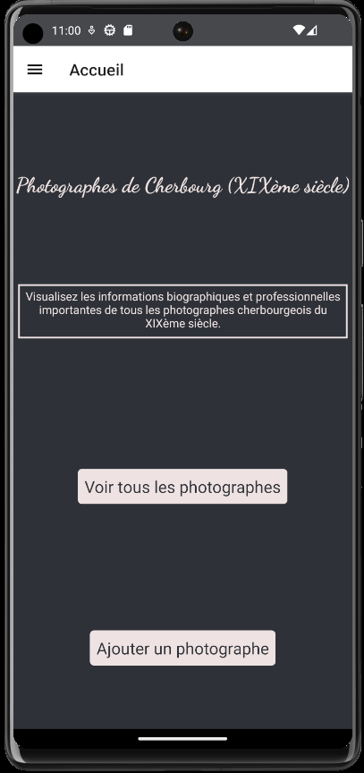
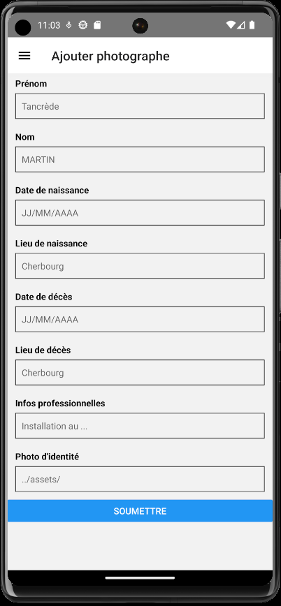

# Appli photographes cherbourgeois du XIXème siècle #

## But : ## 
Récapitulatif des informations biographiques et professionnelles sur les photographes professionnels cherbourgeois.

## Structure : ##
Screen d'accueil (Présentation, button de navigation vers la liste des photographes)
Screen liste des photographes (affichage des noms et prénoms des photographes)
Screen page individuelle d'un photographe (photo d'identité, informations biographiques, infos professionnelles)
Screen ajout d'un photographe (formulaire accessible depuis le drawer)

## Technos : ##
_ React-native

_ Informations photographes enregistrées dans base de données Firebase

## Screen shots : ##

